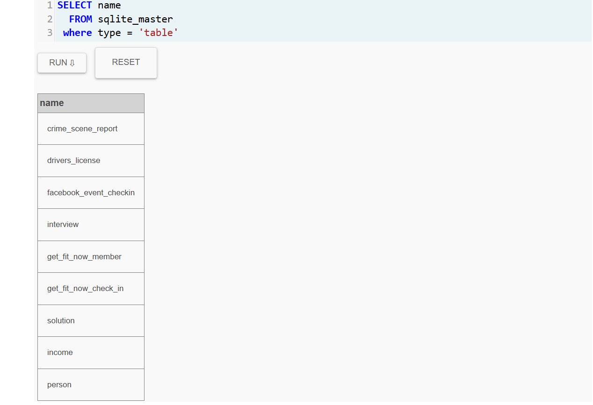
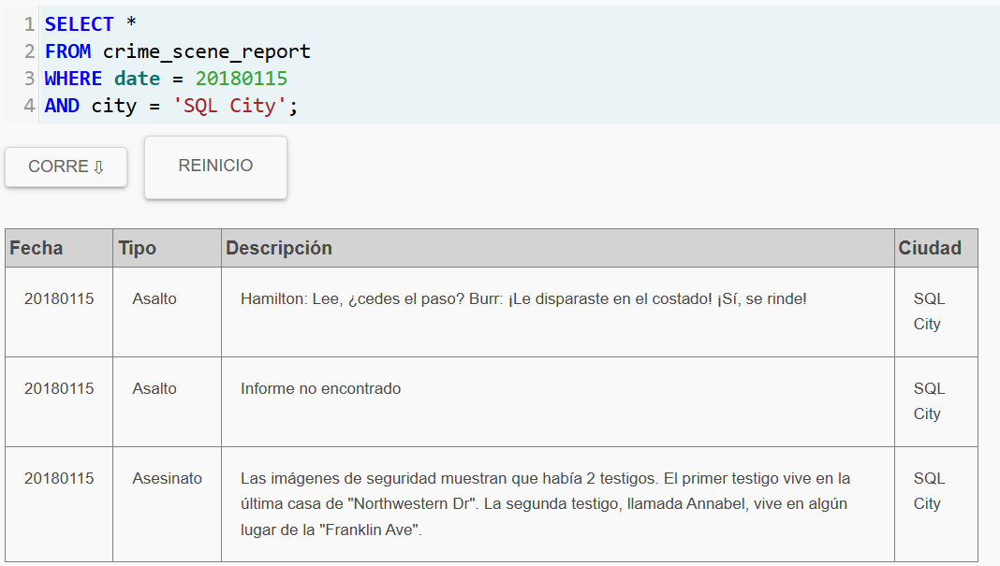
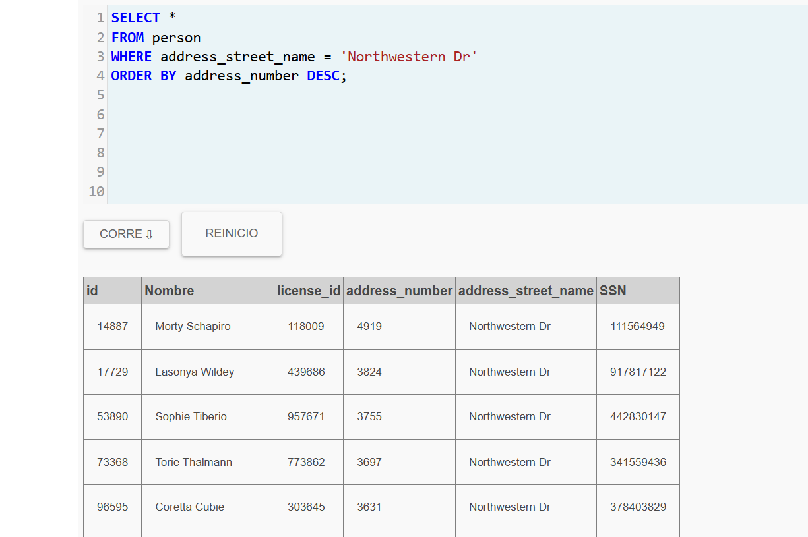
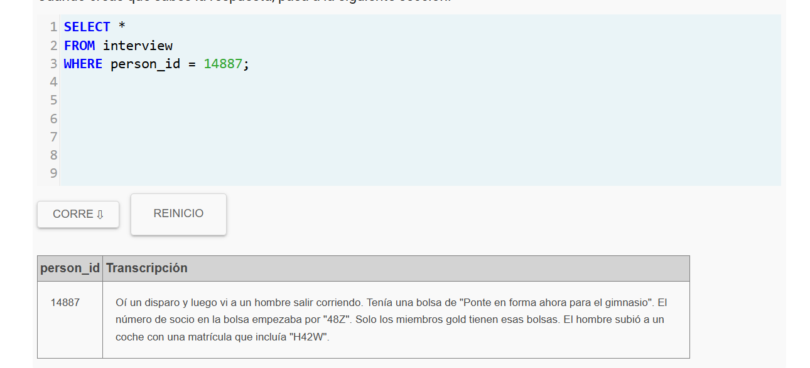
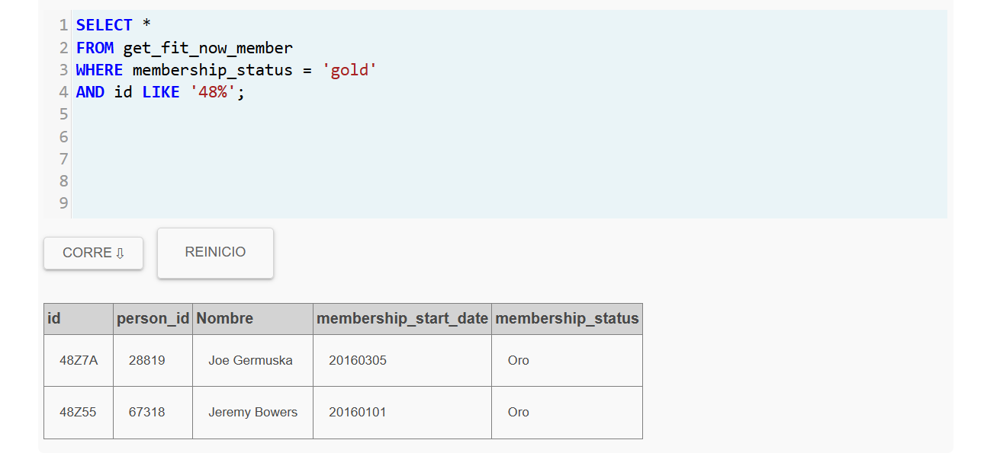
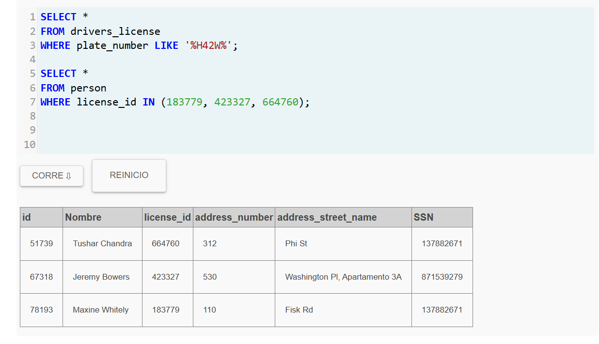
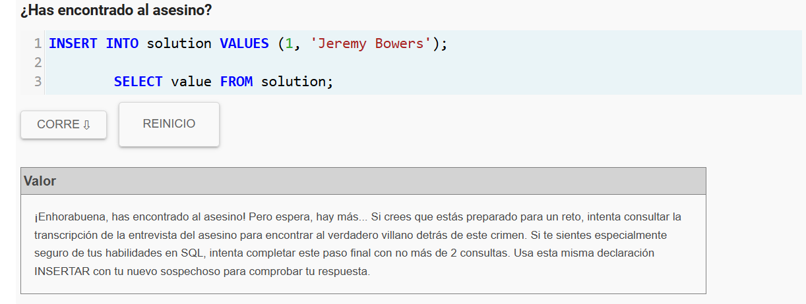
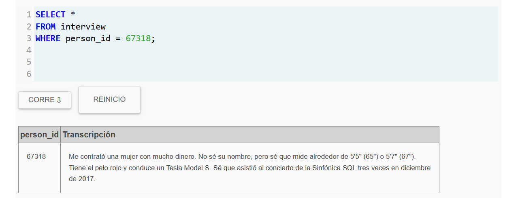
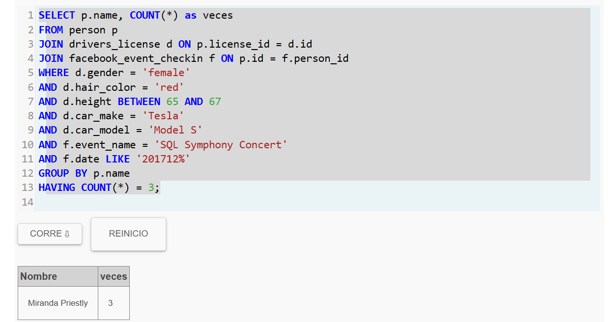
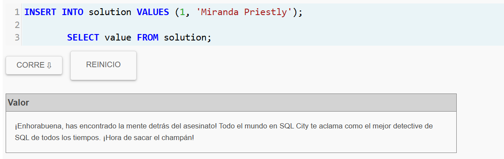

# lab2-sql-murder-JuanFelipeMadro-eroPazos## Paso 1

Actividad: Lab 2 - SQL Murder Mystery

Nombre Detective:Juan Felipe Madroñero Pazos
Correo electronico: felipe.madronero@udea.edu.co

Resumen del caso:

Después de seguir todas las pistas, el que cometió el asesinato fue Jeremy Bowers. Pero el man no actuó solo, lo habían contratado. Al final, juntando todo, la persona que estaba detrás de todo era Miranda Priestly.

Bitácora de investigación:

Primero miré qué tablas había, más que todo para ubicarme y no empezar a buscar a ciegas. Después me fui al reporte del crimen y ahí ya empezaron a salir pistas interesantes, sobre todo lo de los testigos. Luego tocó encontrar a esas personas. Uno vivía en la última casa de Northwestern Dr, así que busqué esa calle y ahí salió Morty. Revisé lo que dijo y ya empezó a dar pistas más concretas, como lo del gimnasio y el carro. Con eso me fui al gym y encontré dos posibles sospechosos. Después usé la pista de la placa del carro y ahí ya se empezó a cerrar más el círculo hasta llegar a Jeremy. Pero cuando vi la entrevista de Jeremy, quedó claro que él no era el que planeó todo. Entonces con las pistas que dio (lo del Tesla, el pelo rojo, la altura y el concierto), armé una búsqueda más completa y ahí fue donde salió la persona final.

Query 1

Antes de empezar con el misterio quise ver primero que tablas habia en la base de datos. Basicamente era como mirar el mapa del juego antes de empezar a explorar.

Para eso se usa esta consulta:

SELECT name
    FROM sqlite_master
   WHERE type = 'table';

Con eso aparecieron varias tablas. Algunas ya dan pistas solo por el nombre. Pero la que mas llama la atencion desde el principio es `crime_scene_report`.
### Evidencia1

## Query 2

Después de ver las tablas me fui directo a `crime_scene_report`.

El caso dice que el asesinato pasó el **15 de enero de 2018 en SQL City**, así que filtré justo ese día para ver qué encontraba.

SELECT *
FROM crime_scene_report
WHERE date = 20180115
AND city = 'SQL City';

AAparecen varios reportes de ese día, pero uno es el del asesinato. En la descripción dicen que hay dos testigos: uno vive en la última casa de **Northwestern Dr** y el otro es **Annabel**, que vive en **Franklin Ave**.

Con eso ya hay por dónde empezar a buscar.

### Evidencia

## Query 3

La pista decía “última casa de Northwestern Dr”, pero pues no decía el número, así que tocó buscar quién vive en esa calle.

SELECT *
FROM person
WHERE address_street_name = 'Northwestern Dr'
ORDER BY address_number DESC;

Ordené de mayor a menor para no ponerme a revisar todo uno por uno. El primero que sale es Morty Schapiro, así que ese debe ser el testigo.

### Evidencia

## Query 4

Ya con el testigo, tocaba ver qué había visto.

SELECT *
FROM interview
WHERE person_id = 14887;

El tipo dice que escuchó el disparo y vio a alguien salir corriendo. Lo interesante es que menciona varias cosas:

- llevaba una bolsa de gimnasio “Get Fit Now”
- el número de socio empezaba por 482
- era miembro gold
- y se fue en un carro con una placa que tenía "H42W"

Con eso ya hay varias pistas para seguir buscando.

### Evidencia

## Query 5

Con lo que dijo el testigo, probé buscar en los miembros del gimnasio.

Primero intenté con los que empezaran por 48 y fueran gold.

SELECT *
FROM get_fit_now_member
WHERE membership_status = 'gold'
AND id LIKE '48%';

Ahí aparecieron dos personas: Joe Germuska y Jeremy Bowers. Entonces uno de ellos debería ser el sospechoso.

### Evidencia

## Query 6

Con la pista de la placa que tenía "H42W", busqué en las licencias a ver qué carros coincidían.

SELECT *
FROM drivers_license
WHERE plate_number LIKE '%H42W%';

Aparecieron tres opciones, así que tocó cruzar eso con la tabla `person` usando los license_id para ver quiénes eran.

SELECT *
FROM person
WHERE license_id IN (183779, 423327, 664760);

Con eso ya salen las personas reales, y ahí se puede ver cuál coincide con lo del gimnasio y las otras pistas.

### Evidencia

## Resultado final

Al cruzar la información del carro con los datos del gimnasio, solo una persona coincide con todas las pistas.

Esa persona es Jeremy Bowers, así que él es el asesino.

### Evidencia

## Query 7

Después de encontrar al asesino (Jeremy Bowers), tocaba ver qué decía en su entrevista.

SELECT *
FROM interview
WHERE person_id = 67318;

Ahí cuenta que él no actuó solo, sino que alguien más lo contrató.

Da varias pistas sobre esa persona: que es una mujer, tiene dinero, maneja un Tesla Model S, tiene el pelo rojo y mide más o menos entre 65 y 67. También dice que fue varias veces a un concierto en diciembre.

Con eso ya se puede seguir buscando al verdadero responsable.

### Evidencia

## Query final

Con las pistas que dio Jeremy armé una búsqueda juntando varias tablas.

Filtré por todo lo que dijo: mujer, pelo rojo, Tesla Model S, altura entre 65 y 67, y además que hubiera ido 3 veces al concierto en diciembre.

SELECT p.name, COUNT(*) as veces
FROM person p
JOIN drivers_license d ON p.license_id = d.id
JOIN facebook_event_checkin f ON p.id = f.person_id
WHERE d.gender = 'female'
AND d.hair_color = 'red'
AND d.height BETWEEN 65 AND 67
AND d.car_make = 'Tesla'
AND d.car_model = 'Model S'
AND f.event_name = 'SQL Symphony Concert'
AND f.date LIKE '201712%'
GROUP BY p.name
HAVING COUNT(*) = 3;

Con eso ya solo queda una persona que cumple todo.

### Evidencia

### Evidencia Autora Intelectual

